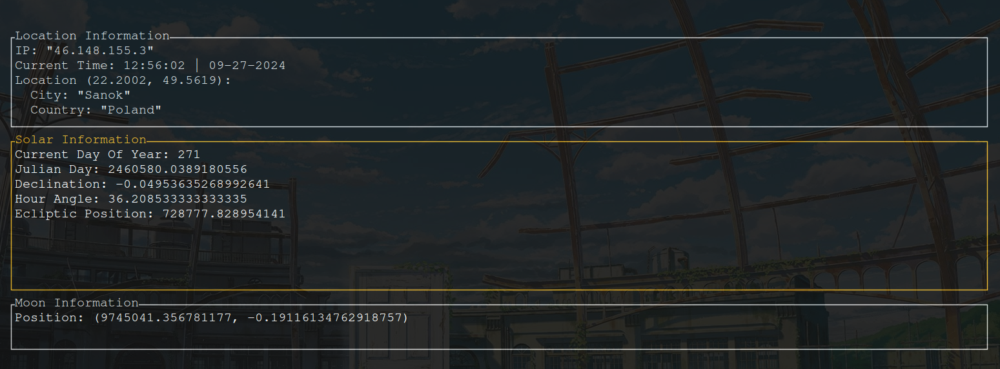

# Solar Position Calculator

This Rust program calculates the solar declination and hour angle based on the current time and the user's IP address. It uses several external crates and modules to achieve this functionality.

## How It Works

### Main Function

The main function is the entry point of the program. It performs the following steps:

1. **Fetch Current IP Address**:
    - Uses the `reqwest` crate to make an asynchronous HTTP GET request to `https://api64.ipify.org?format=json` to fetch the current IP address.
    - Parses the response to extract the IP address using the `serde_json` crate.

2. **Infinite Loop**:
    - Clears the terminal screen.
    - Sleeps for 500 milliseconds.
    - Fetches the current local time using the `chrono` crate.
    - Calculates the Julian Day using the `calculations::julian_day` function.
    - Calculates the current time in hours, minutes, and seconds.
    - Fetches the geographical location (longitude) based on the IP address using the `geolocation::find` function.
    - Calculates the solar declination using the `calculations::solar_declination` function.
    - Calculates the solar hour angle using the `calculations::solar_hour_angle` function.
    - Prints the current local time, Julian Day, solar declination, and solar hour angle to the terminal.

### Modules and Functions

#### `calculations` Module

- **julian_day**:
    - Calculates the Julian Day from the given local time.

- **solar_declination**:
    - Calculates the solar declination based on the Julian Day.

- **solar_hour_angle**:
    - Calculates the solar hour angle based on the Julian Day, current time, and longitude.

#### `geolocation` Module

- **find**:
    - Fetches the geographical location (latitude and longitude) based on the given IP address using the `isahc` crate to make an HTTP GET request to `http://ip-api.com/json/{ip}`.
    - Parses the response to extract the location details.

### External Crates

- **chrono**:
    - Used for handling date and time operations.

- **reqwest**:
    - Used for making HTTP requests.

- **serde_json**:
    - Used for parsing JSON responses.

- **tokio**:
    - Used for asynchronous programming.

## Running the Program

To run the program, ensure you have Rust and Cargo installed. Then, execute the following commands:

```sh
cargo build
cargo run
```

## Photos
